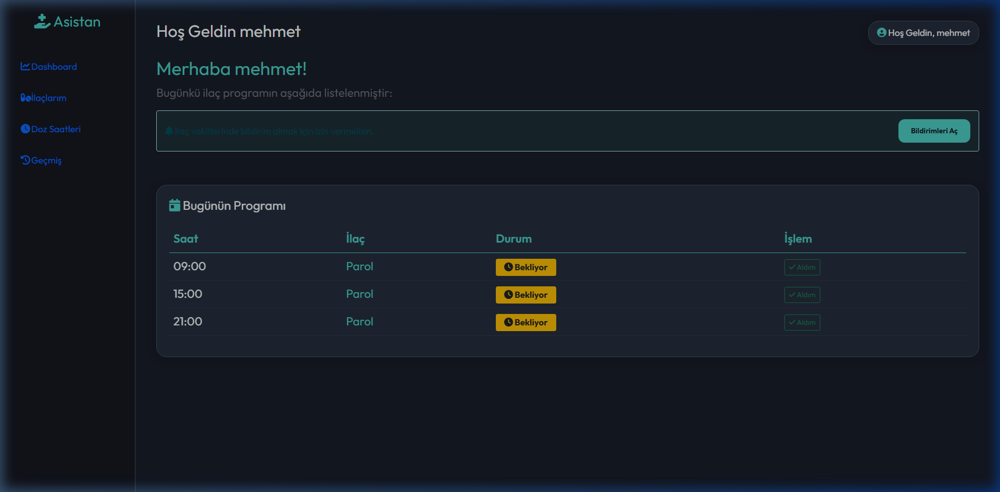
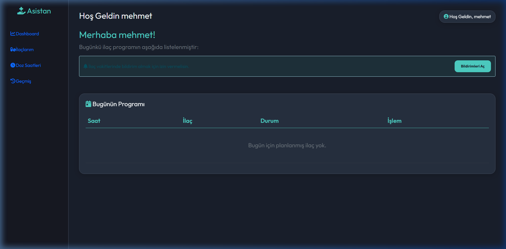
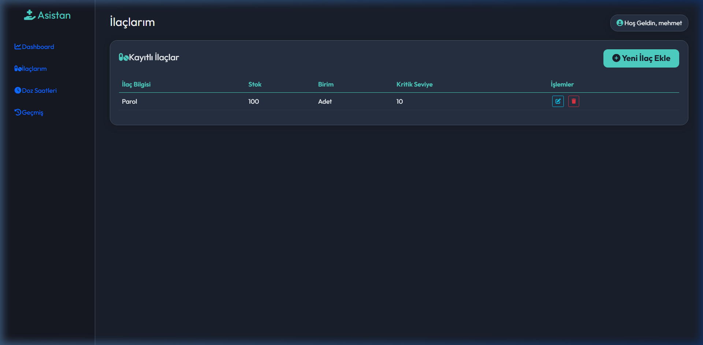
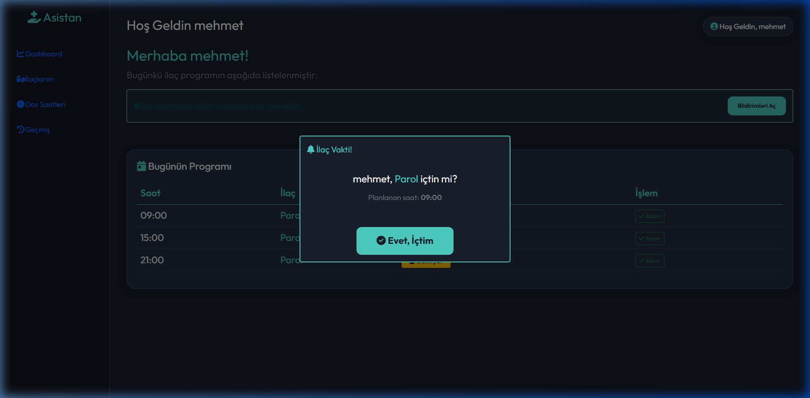
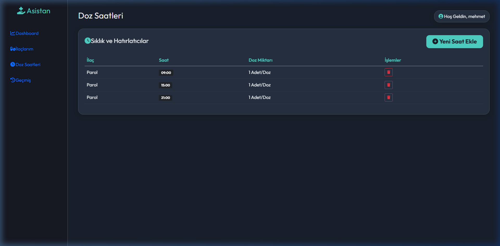

# 💊 İlaç Takip Sistemi (Medicine Tracking System)

Modern, sade ve akıllı bir ilaç takip asistanı. ASP.NET Core 9.0 MVC mimarisi ile geliştirilmiş olan bu sistem, kullanıcıların günlük ilaç rutinlerini aksatmadan yönetmelerini sağlar.



## 🌟 Öne Çıkan Özellikler

- **Hızlı Kurulum (Onboarding):** Kullanıcı adı ve ilaç listesini saniyeler içinde tanımlayan sihirbaz.
- **Akıllı Bildirim Modeli:** İlaç vakti geldiğinde tarayıcı üzerinden sağ alt köşede native (yerel) bildirim ve uygulama içi modal uyarısı.
- **1 Saat Kuralı:** İlaç saati üzerinden 1 saat geçmesine rağmen onaylanmayan dozları otomatik olarak "Kaçırıldı" olarak işaretleme.
- **Dinamik Dashboard:** Bugünün programını, geçmiş dozların durumunu ve sıradaki ilaçları gösteren sade arayüz.
- **Raporlama:** Tüm ilaç kullanım geçmişini tek tıkla **PDF** veya **Excel** olarak dışa aktarma.
- **Mobil Uyumlu:** Responsive tasarım sayesinde telefon ve tabletlerde kusursuz kullanım.

## 📸 Ekran Görüntüleri

| Kurulum | İlaç Listesi |
| :--- | :--- |
|  |  |

| Bildirim Sistemi | Kullanım Geçmişi |
| :--- | :--- |
|  |  |

## 🛠️ Teknoloji Yığını

- **Backend:** .NET 9.0 MVC
- **Database:** Entity Framework Core (SQLite)
- **Frontend:** HTML5, CSS3, JavaScript (ES6+), Bootstrap 5
- **Design:** Glassmorphism UI, FontAwesome 6, Google Fonts (Outfit)
- **Export Tools:** jsPDF, XLSX (SheetJS)

## 🚀 Kurulum ve Çalıştırma

1. Projeyi klonlayın:
   ```bash
   git clone https://github.com/taklaci59/ilac-takip-sistemi.git
   ```
2. Proje dizinine gidin:
   ```bash
   cd ilac-takip-sistemi
   ```
3. Bağımlılıkları yükleyin:
   ```bash
   dotnet restore
   ```
4. Uygulamayı çalıştırın:
   ```bash
   dotnet run
   ```
5. Tarayıcıdan `http://localhost:5000` adresine gidin.

## 📂 Klasör Yapısı

```text
ilactakipsistem/
├── Controllers/         # İş mantığı ve yönlendirme
├── Models/              # Veri modelleri (Medicine, DosageSchedule, UsageLog, UserProfile)
├── Data/                # EF Core AppDbContext ve Migrations
├── Views/               # Razor Görünümleri (Dashboard, Onboarding, History)
├── wwwroot/             # Statik dosyalar (CSS, JS, Resimler)
├── screenshots/         # Proje görselleri
└── MedicineApp.db       # SQLite Veritabanı
```

## 📄 Lisans

Bu proje MIT lisansı ile lisanslanmıştır.

---
*Developed with ❤️ by taklaci59*
